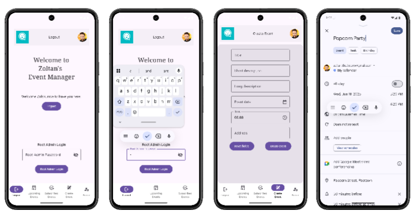
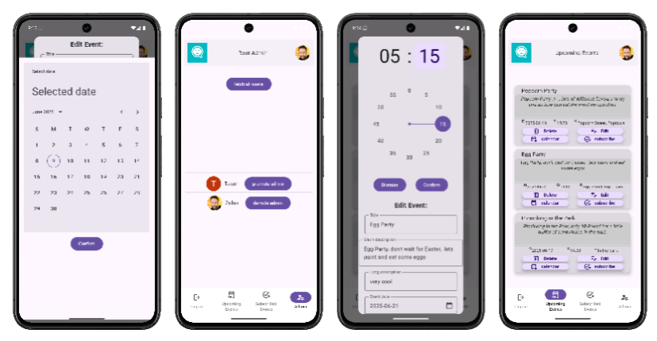
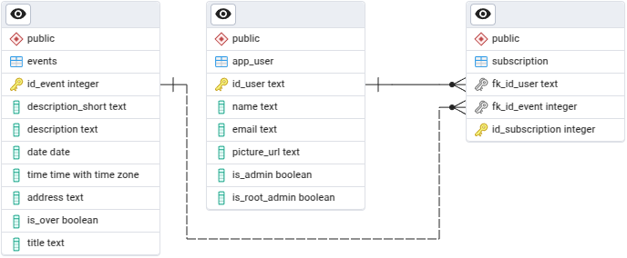
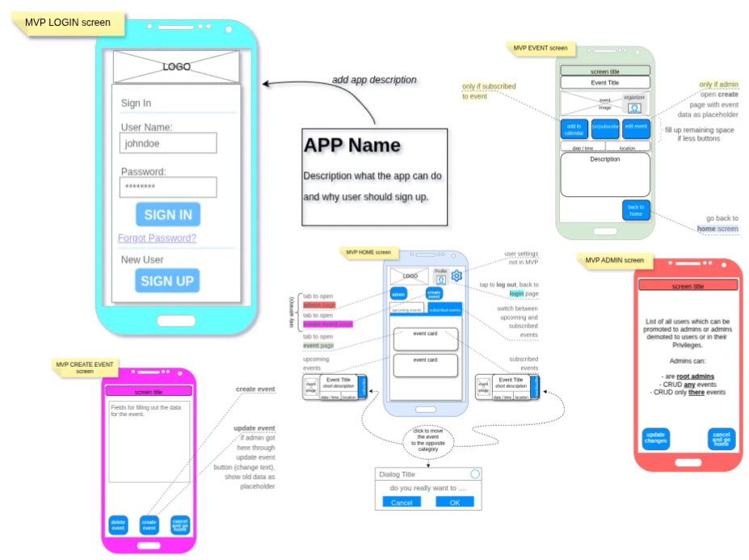

# Welcome to Zoltans Event Manager


---
- [project structure](#how-is-the-project-structured)
- [app walkthrough](#walkthrough)
- [security](#security)
- [how to run-install the app](#how-to-run-install-the-app)
- [entity relationship diagram](#entity-relationship-diagram)
- [wireframe](#wireframe)

---
## What is 'Zoltans Event Manager' ?
Is mainly a Android application in which the User can subscribe to events and the Event Organizer can create, update, and delete those events.  
One of the bonus features is the possibility for the user to import events to their Google Calendar.  
Authentication is handled by Google, which is safe and convenient for the users and organizers.

---

## How is the project Structured?
the project consists of 3 parts:  
**Backend:**  
- the Postgres database to store user and event data
- the Java Spring Boot application running on a server managing requests  

**Frontend:** 
- the Kotlin Android Application where events can be seen and managed.

## App Walkthrough

- the **User**:
    - can conveniently and safely **log in with his google** account
    - can see **upcoming events**, after subscribing to them, those events move to **subscribed events**, this keeps the list clean
    - can add events to his google calendar (*needs to be already installed on the phone*)  
- the **Admin**: 
    - can **create**, **update** and **delete** events, all this while keeping the UI clean
    - dose not need to remember any extra passwords, he also logs in with his google account
- the **Root Admin**:
    - has the power to demote or promote any user with a click of a button to an admin
    - has an **extra password to login** for added security
- the **UI is clean** and easy to navigate, e.g. *users do not to see admin related functionality*
- text output while logging in informs the user about the progress and there are many **toast messages to keep the users updated**.  



### More Features
- the server at the backend runs coast efficiently on a **headless Ubuntu server**
- **beautiful UI** with Jetpack Compose and Google Material Design

## Security
- The **user logs in with his Google account**, no passwords are stored in the app or backend.  
- If google authenticates the user, the **app receives then a "google id token"** which already contains information about the user, *e.g. name, email, picture, ...* .  
- The "google id token" is then send to the backend, which than again checks with Google the authenticity and creates then a **Json Web Token** which is used for further authentication.
- The Android application needs to register with its **SHA-1 certificate fingerprint** by Google and a special for this app from Google Created **Web Client ID** key is used.


## How to run-install the app
**NOTE:** this repo contains two submodules, cloning this repo will not clone the submodules!  
You can run the Android application in your Android Studio emulator. You can use the backend server running on a server, and do not need to install the Java backend application or set up the PostgreSQL database. 

### Front End Android App
1. follow this [*link*](https://github.com/Zolske/Zoltans-Evant-Manager-Frontend/tree/main) to get to the Github repository and clone it, make sure it is the **main branch**.

2. change into the root directory:  
`cd Zoltans-Evant-Manager-Frontend`


##### `local.properties_BLUEPRINT` *file, for setting credentials*
3. Add the values which I gave you to the keys and then past those together with the keys to your
'local.properties' file.

```
WEB_CLIENT_ID=""         # provided by me

BASE_URL_BACKEND=""      # provide by me, or clone backend for local backend

ROOT_ADMIN_PASSWORD=""   # you choose the password which is going to be the password
                         # for the root user in the app
```

- *may be you have to build your project again after updating the 'local.properties' file  

#### [Set up your Google Cloud Console project](https://developer.android.com/identity/sign-in/credential-manager-siwg#set-google)
*... in the mean time you can open the project in Android Studio, ...*  
For Google authentication to work, you need to register the cloned project with google. 

1. Open your project in the [Cloud Console](https://console.developers.google.com/auth/overview), or create a project if you don't already have one.
.
2. On the Client page of one of your projects or create a new project, you need to create a client with the SHA-1 signature and the apps package name.  

**name**: *what ever you like*  

**package name**: `com.kepes.zoltanseventmanagerfrontend`  

**SHA-1 certificate fingerprint**: *see instructions below*
- on your terminal run:  
`keytool -list -v -keystore ~/.android/debug.keystore -alias androiddebugkey -storepass android -keypass android`  
and enter the key into the field

3. click on **create** create  


### Backend End
- say 'hi' to the backend application by clicking on the [link](http://167.86.118.254:8080/api/auth/hello)  

1. Clone the [main repository](https://github.com/Zolske/Zoltans-Event-Manager-Backend) into your project directory. 


##### Cred class for 'web client id'
2. `Rename` the [`Cred_BLUEPRINT.java`](https://github.com/Zolske/Zoltans-Event-Manager-Backend/blob/main/src/main/java/com/kepes/config/Cred_BLUEPRINT.java) to `Cred.java` which you can find under */src/main/java/com/kepes/config/*, user intelij **renaming** command!

3. Past the 'web client id' which I gave to you to the constant:  
```
public class Cred_BLUEPRINT {
    private static final String WEB_CLIENT_ID = ""; // <- past id here

    public String getWebClientId() {
        return WEB_CLIENT_ID;
    }
```
##### 'credential.properties_BLUEPRINT'
4. `Rename` the [`credential.properties_BLUEPRINT`](https://github.com/Zolske/Zoltans-Event-Manager-Backend/blob/main/src/main/resources/credential.properties_BLUEPRINT) to `credential.properties`.  

```
spring.datasource.username=   // <- your postgresql user name
spring.datasource.password=   // <- your postgresql password
WEB_CLIENT_ID=                // <- 'web client id'
```
##### 'application.properties'
5. Change the name of 'event_manager' to the name of your database  
`spring.datasource.url=jdbc:postgresql://localhost:5432/event_manager`


### PostgreSQL database
1. At the root of the backend is the [`schema.sql`](https://github.com/Zolske/Zoltans-Event-Manager-Backend/blob/main/schema.sql) file, which contains the instructions of how to build the database.  
Replace `<USERNAME>` with your user name and `<DBNAME>` with the name of your database, then run the command:  
`psql -U <USERNAME> -d <DBNAME> -f schema.sql` 

## App Design 

### Entity Relationship Diagram 



#### Relationships

**One-to-many between app_user and subscription**:  
One user can subscribe to many events.

**One-to-many between events and subscription:**  
One event can have many user subscriptions.

The models a many-to-many relationship between app_user and events, via subscription

## Wireframe


Original wireframing of the app, due to time constraints and technical obstacles, cuts had to be made.
